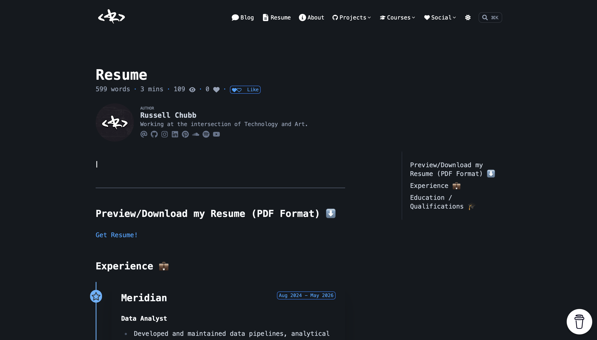
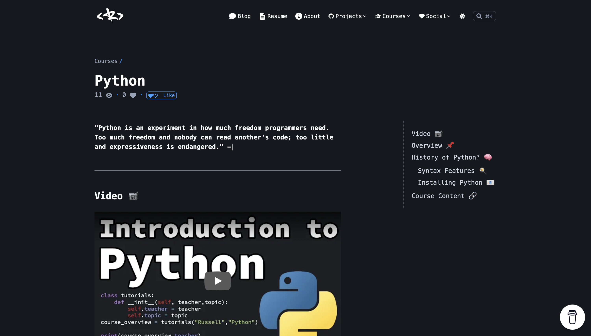

```text
██████╗ ██╗   ██╗███████╗███████╗███████╗██╗     ██╗     ███████╗
██╔══██╗██║   ██║██╔════╝██╔════╝██╔════╝██║     ██║     ██╔════╝
██████╔╝██║   ██║███████╗███████╗█████╗  ██║     ██║     ███████╗
██╔══██╗██║   ██║╚════██║╚════██║██╔══╝  ██║     ██║     ╚════██║
██║  ██║╚██████╔╝███████║███████║███████╗███████╗███████╗███████║
╚═╝  ╚═╝ ╚═════╝ ╚══════╝╚══════╝╚══════╝╚══════╝╚══════╝╚══════╝
                                                                 
██╗    ██╗███████╗██████╗ ███████╗██╗████████╗███████╗           
██║    ██║██╔════╝██╔══██╗██╔════╝██║╚══██╔══╝██╔════╝           
██║ █╗ ██║█████╗  ██████╔╝███████╗██║   ██║   █████╗             
██║███╗██║██╔══╝  ██╔══██╗╚════██║██║   ██║   ██╔══╝             
╚███╔███╔╝███████╗██████╔╝███████║██║   ██║   ███████╗           
 ╚══╝╚══╝ ╚══════╝╚═════╝ ╚══════╝╚═╝   ╚═╝   ╚══════╝           
```

## Pictures






## About

Built as a fast, clean static site with Hugo — designed to showcase:

* work
* writing
* the weird little ideas that turn into something useful.

## Tech Stack

* **Hugo** — Static site generator
* **HTML / CSS / JavaScript** — Front-end structure, styling and interactions

## How to Run Locally

### 1. Clone the Repository

[Clone the repository](https://www.youtube.com/watch?v=bQrtezWlphU) to your local machine:

```bash
git clone <repository-url>
cd <repository-directory>
```

### 2. Install Hugo

Make sure [Hugo](https://gohugo.io/installation/) is installed on your machine.

### 3. Start the Development Server

From the root of the repository, run:

```bash
hugo server -D
```

### 4. Open the Site

Once Hugo has started the development server, open `http://localhost:1313` on your browser.

**NOTE:** Hugo will automatically rebuild the site as you make changes, so you can develop with live reload enabled.

## Contributing

This is primarily a personal project, but suggestions, bug fixes and improvements are always welcome.

If you'd like to contribute:

1. Fork the repository
2. Create a new branch for your changes
3. Make your changes and test them locally
4. Open a pull request with a short description of what you've changed

For larger changes, feel free to open an issue first so we can discuss the idea.

## License

This project is for personal use. [Please contact me](mailto:russell.d.chubb@gmail.com?subject=Website%20Enquiry) before reusing substantial portions of the site.
