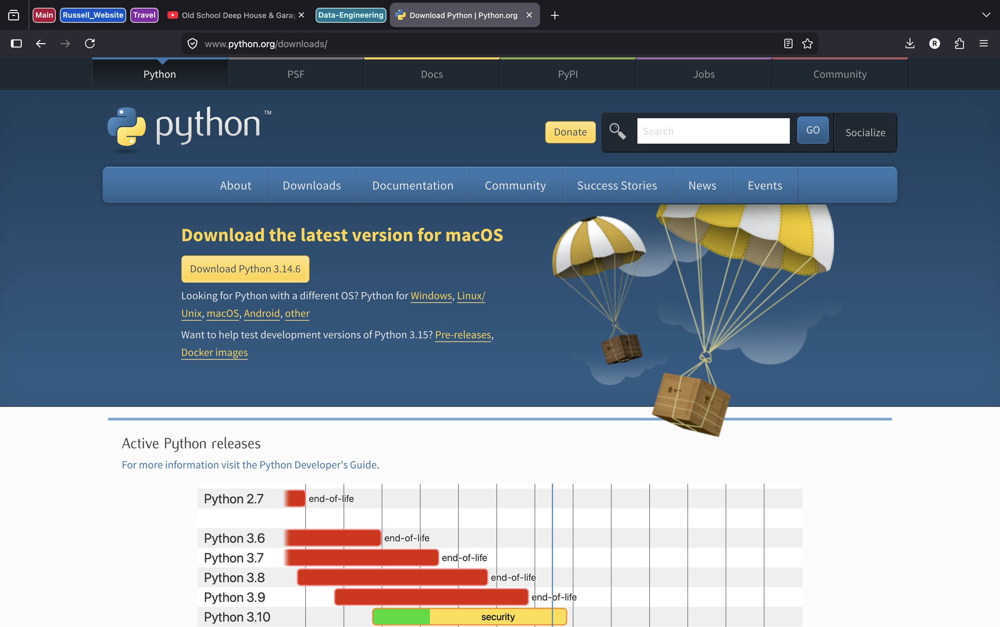
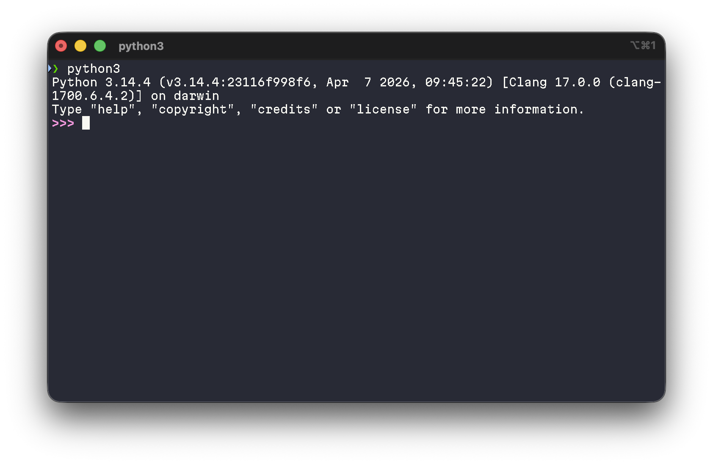
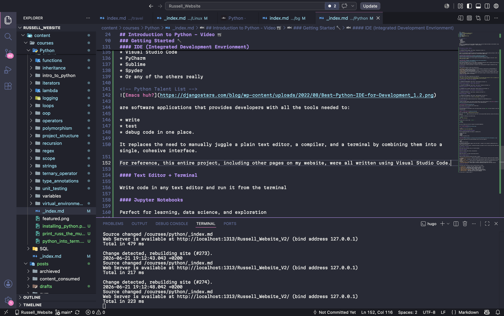

<!-- Guidoooooooo -->

"Python is an experiment in how much freedom programmers need. Too much freedom and nobody can read another's code; too little and expressiveness is endangered." - Guido van Rossum


---

## Video 📹

<!-- YouTube Video Link -->


## Overview 📌

Python is an interpreted, high-level, general-purpose programming language, known for its *easy-to-read syntax*.

Python allows programmers to express concepts in fewer lines of code than other languages such as C++ or Java.

<!-- Python Meme -->

## History of Python? 🧠

Python was created by Guido van Rossum in 1991. Python's name is inspired by Monty Python's Flying Circus, a British sketch comedy series.

Over the years, Python has grown to become one of the most popular programming languages in the world.

<!-- YouTube Video Link (Nobody expects the Spanish Inquisition) -->


Python is a versatile language used in a wide variety of applications, including:

* Web-Development
* Data Science / Machine Learning
* Automation
* Software Development
* Network Programming.

<!-- Python use-cases Image -->

Python is known for its clean and readable syntax, making it an excellent choice for beginners and experienced developers alike.

### Syntax Features 🍳

Python uses indentation to define the structure of the code (*which enhances readability...*)

<!-- Identation Meme -->

Variables in Python do not need explicit declaration of their type. (*The type is inferred based on the value assigned*)

<!-- Strongly Dynamic Meme -->

Python comes with a comprehensive standard library that provides tools suited to many tasks.

<!-- Comprehensive Standard Library Meme -->

### Installing Python 📧

To get started with Python, you need to install it on your computer!

> [!IMPORTANT]
> You can download Python from the [Official Python Website](https://www.python.org/).

<!-- Python Website -->

Then, follow the installation instructions specific to your operating system.

Once installed, you can run Python code in several ways:

* Through your terminal

* In an IDE such as Visual Studio Code (*or Pycharm*).

* Or in a Notebook application (*such as Google Colab, or Jupyter*)

## Course Content 🔗

Without further ado... Here's the course content!
